# 🔄 System Interaction Diagrams

## High-Level System Architecture

## Data Flow Architecture

## News Collection Flow

## Monitoring & Health Check Flow

## Autoscaling Flow

## Cache Management Flow

## Cost Optimization Flow

## Service Discovery & Communication

## Error Handling & Resilience

```mermaid
graph TB
    subgraph "Resilience Patterns"
        CB[Circuit Breaker<br/>5 failures → Open<br/>60s timeout]
        RL[Retry Logic<br/>3 retries<br/>Exponential backoff]
        TO[Timeouts<br/>DB: 5s, API: 30s]
        CP[Connection Pooling<br/>Reuse connections]
        RL2[Rate Limiting<br/>Respect API quotas]
    end
    
    subgraph "Error Handling"
        EH[Error Handling<br/>Try-catch blocks]
        GD[Graceful Degradation<br/>Fallback mechanisms]
        EC[Error Context<br/>Timestamp, service, operation]
        AR[Auto Recovery<br/>Where possible]
    end
    
    subgraph "Health Monitoring"
        HC[Health Checks<br/>Continuous monitoring]
        HS[Health Score<br/>100/100]
        AL[Alerting<br/>Prometheus + Alertmanager]
    end
    
    CB --> EH
    RL --> EH
    TO --> EH
    CP --> EH
    RL2 --> EH
    
    EH --> GD
    EH --> EC
    EH --> AR
    
    HC --> HS
    HS --> AL
```

## Performance Characteristics

## Access Points & Port Forwards

## Summary

These diagrams illustrate the comprehensive interaction patterns within the Crypto Data Collection System:

1. **High-Level Architecture**: Shows the complete system with all components and their relationships
2. **Data Flow**: Demonstrates how data flows through the system from external sources to storage
3. **News Collection**: Details the news collection and sentiment analysis process
4. **Monitoring**: Shows continuous health monitoring and alerting
5. **Autoscaling**: Illustrates how the system automatically scales based on load
6. **Cache Management**: Details intelligent cache management and optimization
7. **Cost Optimization**: Shows real-time cost tracking and optimization
8. **Service Discovery**: Demonstrates Kubernetes DNS-based service communication
9. **Error Handling**: Shows resilience patterns and error handling mechanisms
10. **Performance**: Illustrates current performance characteristics and scaling
11. **Access Points**: Shows how to access the system through port forwards

The system is designed for high availability, scalability, and maintainability with clear separation of concerns and well-defined integration points.
