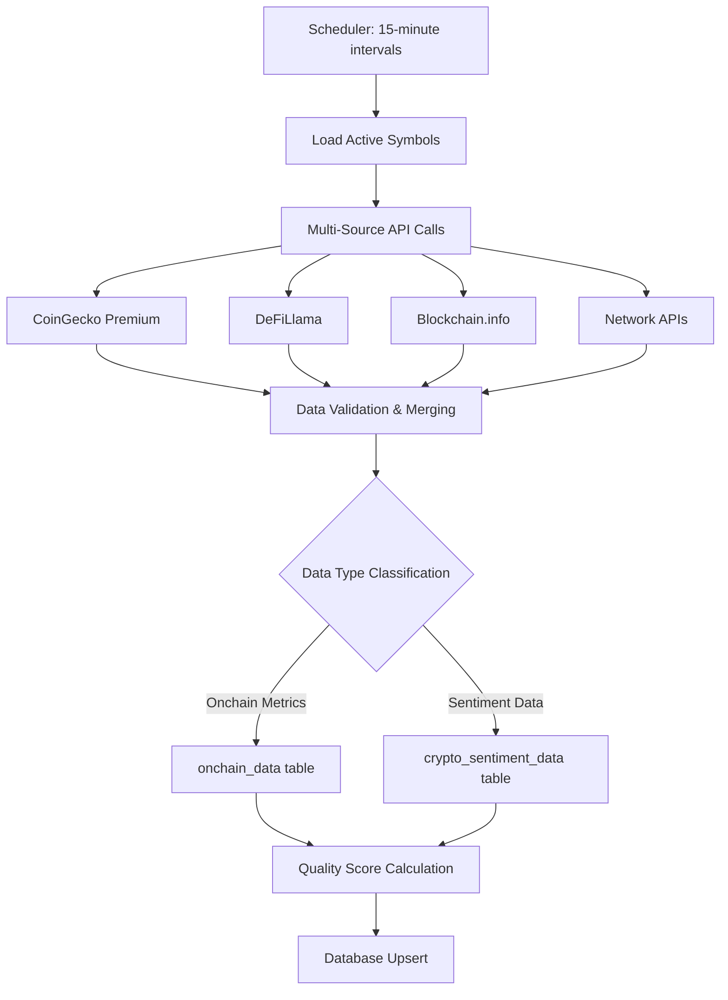

# Database Architecture & Data Flow

## 🏗️ Architecture Overview

The Enhanced Onchain Data Collector follows a clean separation of concerns architecture, with distinct data domains properly segregated across dedicated database tables. This design ensures data integrity, optimal query performance, and clear separation between onchain metrics and sentiment analysis.

---

## 📊 Database Schema Design

### **Core Tables Structure**

```sql
-- Primary onchain metrics table
CREATE TABLE onchain_data (
    id BIGINT AUTO_INCREMENT PRIMARY KEY,
    symbol VARCHAR(100) NOT NULL,
    coin_id VARCHAR(150) NOT NULL,
    timestamp_iso DATETIME(6) NOT NULL,
    
    -- Network Activity Metrics
    active_addresses BIGINT,
    transaction_count BIGINT,
    transaction_volume DECIMAL(25,8),
    block_height BIGINT,
    block_time_seconds DECIMAL(10,2),
    
    -- Blockchain Security (PoW only)
    hash_rate DECIMAL(25,8),           -- NULL for PoS networks
    difficulty DECIMAL(25,8),          -- NULL for PoS networks
    
    -- Supply Economics
    circulating_supply DECIMAL(25,8),
    total_supply DECIMAL(25,8),
    max_supply DECIMAL(25,8),
    supply_inflation_rate DECIMAL(10,4),
    
    -- Network Value Metrics
    network_value_to_transactions DECIMAL(20,8),
    realized_cap DECIMAL(25,2),
    mvrv_ratio DECIMAL(10,4),
    nvt_ratio DECIMAL(10,4),
    
    -- Development Activity
    github_commits_30d INT,
    developer_activity_score DECIMAL(10,4),
    
    -- Staking Metrics (PoS only)
    staking_yield DECIMAL(10,4),       -- NULL for PoW networks
    staked_percentage DECIMAL(10,4),   -- NULL for PoW networks
    validator_count INT,               -- NULL for PoW networks
    
    -- DeFi Ecosystem
    total_value_locked DECIMAL(25,2),
    defi_protocols_count INT,
    
    -- Data Quality
    data_source VARCHAR(100),
    data_quality_score DECIMAL(3,2),
    
    collected_at TIMESTAMP DEFAULT CURRENT_TIMESTAMP,
    
    -- Indexes for performance
    INDEX idx_symbol_timestamp (symbol, timestamp_iso),
    INDEX idx_collected_at (collected_at),
    INDEX idx_quality_score (data_quality_score)
) ENGINE=InnoDB DEFAULT CHARSET=utf8mb4 COLLATE=utf8mb4_unicode_ci;

-- Separate sentiment analysis table
CREATE TABLE crypto_sentiment_data (
    id BIGINT AUTO_INCREMENT PRIMARY KEY,
    symbol VARCHAR(100) NOT NULL,
    coin_id VARCHAR(150) NOT NULL,
    timestamp_iso DATETIME(6) NOT NULL,
    
    -- Social Sentiment Metrics
    reddit_posts_24h INT,
    reddit_comments_24h INT,
    reddit_subscribers INT,
    reddit_avg_posts_48h DECIMAL(10,2),
    reddit_karma_avg_48h DECIMAL(15,2),
    
    twitter_followers INT,
    telegram_channel_user_count INT,
    
    -- Community Engagement
    social_sentiment_score DECIMAL(5,2),
    community_score DECIMAL(5,2),
    
    -- Data Quality
    data_source VARCHAR(100),
    data_quality_score DECIMAL(3,2),
    
    collected_at TIMESTAMP DEFAULT CURRENT_TIMESTAMP,
    
    INDEX idx_symbol_timestamp (symbol, timestamp_iso),
    INDEX idx_sentiment_score (social_sentiment_score)
) ENGINE=InnoDB DEFAULT CHARSET=utf8mb4 COLLATE=utf8mb4_unicode_ci;

-- Asset management table
CREATE TABLE crypto_assets (
    id INT AUTO_INCREMENT PRIMARY KEY,
    symbol VARCHAR(20) NOT NULL UNIQUE,
    coin_id VARCHAR(100) NOT NULL UNIQUE,
    name VARCHAR(255) NOT NULL,
    network_type ENUM('pow', 'pos', 'hybrid') NOT NULL,
    is_active BOOLEAN DEFAULT TRUE,
    market_cap_rank INT,
    
    created_at TIMESTAMP DEFAULT CURRENT_TIMESTAMP,
    updated_at TIMESTAMP DEFAULT CURRENT_TIMESTAMP ON UPDATE CURRENT_TIMESTAMP,
    
    INDEX idx_active_rank (is_active, market_cap_rank)
) ENGINE=InnoDB DEFAULT CHARSET=utf8mb4 COLLATE=utf8mb4_unicode_ci;
```

---

## 🔄 Data Flow Pipeline

### **1. Data Collection Process**



### **2. Collection Workflow Implementation**

```python
async def collect_and_store_data():
    """Main collection workflow with proper data segregation"""
    
    # 1. Load active symbols from database
    symbols = await load_active_crypto_symbols()
    
    # 2. Collect data for each symbol
    for symbol_data in symbols:
        try:
            # Multi-source data collection
            raw_data = await collect_multi_source_data(
                symbol=symbol_data['symbol'],
                coin_id=symbol_data['coin_id'],
                network_type=symbol_data['network_type']
            )
            
            # 3. Segregate data by domain
            onchain_metrics = extract_onchain_metrics(raw_data)
            sentiment_metrics = extract_sentiment_metrics(raw_data)
            
            # 4. Store in appropriate tables
            if onchain_metrics:
                await store_onchain_data(symbol_data['symbol'], onchain_metrics)
            
            if sentiment_metrics:
                await store_sentiment_data(symbol_data['symbol'], sentiment_metrics)
                
        except Exception as e:
            logger.error(f"Collection failed for {symbol_data['symbol']}: {e}")
            continue
```

### **3. Data Segregation Logic**

```python
def extract_onchain_metrics(raw_data):
    """Extract onchain-specific metrics from collected data"""
    return {
        # Network Activity
        'active_addresses': raw_data.get('active_addresses'),
        'transaction_count': raw_data.get('transaction_count'),
        'transaction_volume': raw_data.get('transaction_volume'),
        'block_height': raw_data.get('block_height'),
        'block_time_seconds': raw_data.get('block_time_seconds'),
        
        # Blockchain Security (PoW only)
        'hash_rate': raw_data.get('hash_rate'),
        'difficulty': raw_data.get('difficulty'),
        
        # Supply Economics
        'circulating_supply': raw_data.get('circulating_supply'),
        'total_supply': raw_data.get('total_supply'),
        'max_supply': raw_data.get('max_supply'),
        'supply_inflation_rate': raw_data.get('supply_inflation_rate'),
        
        # Network Value Metrics
        'network_value_to_transactions': raw_data.get('nvt_ratio'),
        'realized_cap': raw_data.get('realized_cap'),
        'mvrv_ratio': raw_data.get('mvrv_ratio'),
        
        # Development Activity
        'github_commits_30d': raw_data.get('github_commits_30d'),
        'developer_activity_score': raw_data.get('developer_activity_score'),
        
        # Staking Metrics (PoS only)
        'staking_yield': raw_data.get('staking_yield'),
        'staked_percentage': raw_data.get('staked_percentage'),
        'validator_count': raw_data.get('validator_count'),
        
        # DeFi Ecosystem
        'total_value_locked': raw_data.get('total_value_locked'),
        'defi_protocols_count': raw_data.get('defi_protocols_count'),
        
        # Metadata
        'data_source': raw_data.get('data_source'),
        'data_quality_score': raw_data.get('data_quality_score')
    }

def extract_sentiment_metrics(raw_data):
    """Extract sentiment-specific metrics from collected data"""
    community_data = raw_data.get('community_data', {})
    
    if not community_data:
        return None
    
    return {
        # Reddit Metrics
        'reddit_posts_24h': community_data.get('reddit_posts_24h'),
        'reddit_comments_24h': community_data.get('reddit_comments_24h'),
        'reddit_subscribers': community_data.get('reddit_subscribers'),
        'reddit_avg_posts_48h': community_data.get('reddit_avg_posts_48h'),
        'reddit_karma_avg_48h': community_data.get('reddit_karma_avg_48h'),
        
        # Social Metrics
        'twitter_followers': community_data.get('twitter_followers'),
        'telegram_channel_user_count': community_data.get('telegram_channel_user_count'),
        
        # Calculated Sentiment Scores
        'social_sentiment_score': calculate_social_sentiment_score(community_data),
        'community_score': calculate_community_score(community_data),
        
        # Metadata
        'data_source': raw_data.get('data_source'),
        'data_quality_score': raw_data.get('data_quality_score')
    }
```

---

## 💾 Database Operations

### **Upsert Operations with Conflict Resolution**

```python
async def store_onchain_data(symbol: str, data: dict):
    """Store onchain data with intelligent upsert logic"""
    
    timestamp_iso = datetime.utcnow().isoformat()
    
    # Prepare insert query with ON DUPLICATE KEY UPDATE
    query = """
    INSERT INTO onchain_data (
        symbol, coin_id, timestamp_iso,
        active_addresses, transaction_count, transaction_volume,
        block_height, block_time_seconds, hash_rate, difficulty,
        circulating_supply, total_supply, max_supply, supply_inflation_rate,
        network_value_to_transactions, realized_cap, mvrv_ratio, nvt_ratio,
        github_commits_30d, developer_activity_score,
        staking_yield, staked_percentage, validator_count,
        total_value_locked, defi_protocols_count,
        data_source, data_quality_score
    ) VALUES (
        %(symbol)s, %(coin_id)s, %(timestamp_iso)s,
        %(active_addresses)s, %(transaction_count)s, %(transaction_volume)s,
        %(block_height)s, %(block_time_seconds)s, %(hash_rate)s, %(difficulty)s,
        %(circulating_supply)s, %(total_supply)s, %(max_supply)s, %(supply_inflation_rate)s,
        %(network_value_to_transactions)s, %(realized_cap)s, %(mvrv_ratio)s, %(nvt_ratio)s,
        %(github_commits_30d)s, %(developer_activity_score)s,
        %(staking_yield)s, %(staked_percentage)s, %(validator_count)s,
        %(total_value_locked)s, %(defi_protocols_count)s,
        %(data_source)s, %(data_quality_score)s
    )
    ON DUPLICATE KEY UPDATE
        active_addresses = COALESCE(VALUES(active_addresses), active_addresses),
        transaction_count = COALESCE(VALUES(transaction_count), transaction_count),
        transaction_volume = COALESCE(VALUES(transaction_volume), transaction_volume),
        block_height = GREATEST(COALESCE(VALUES(block_height), 0), COALESCE(block_height, 0)),
        total_value_locked = COALESCE(VALUES(total_value_locked), total_value_locked),
        data_quality_score = GREATEST(VALUES(data_quality_score), data_quality_score),
        collected_at = CURRENT_TIMESTAMP
    """
    
    # Prepare data with NULL handling
    params = {
        'symbol': symbol,
        'coin_id': data.get('coin_id'),
        'timestamp_iso': timestamp_iso,
        **data
    }
    
    await execute_query(query, params)
```

### **Data Retrieval Optimizations**

```python
async def get_latest_onchain_data(symbols: List[str], hours: int = 24):
    """Retrieve latest onchain data with optimized queries"""
    
    query = """
    SELECT o1.* 
    FROM onchain_data o1
    INNER JOIN (
        SELECT symbol, MAX(timestamp_iso) as latest_time
        FROM onchain_data 
        WHERE symbol IN %(symbols)s 
          AND timestamp_iso >= DATE_SUB(NOW(), INTERVAL %(hours)s HOUR)
        GROUP BY symbol
    ) o2 ON o1.symbol = o2.symbol AND o1.timestamp_iso = o2.latest_time
    ORDER BY o1.timestamp_iso DESC
    """
    
    return await fetch_all(query, {
        'symbols': tuple(symbols),
        'hours': hours
    })

async def get_data_quality_summary():
    """Get data quality metrics across all collections"""
    
    query = """
    SELECT 
        symbol,
        AVG(data_quality_score) as avg_quality,
        COUNT(*) as total_records,
        MAX(timestamp_iso) as latest_collection,
        SUM(CASE WHEN data_quality_score >= 0.9 THEN 1 ELSE 0 END) / COUNT(*) as high_quality_ratio
    FROM onchain_data
    WHERE timestamp_iso >= DATE_SUB(NOW(), INTERVAL 24 HOUR)
    GROUP BY symbol
    ORDER BY avg_quality DESC
    """
    
    return await fetch_all(query)
```

---

## 🔍 Data Quality Management

### **Schema Coverage Analysis**

```python
async def analyze_schema_coverage():
    """Analyze database schema field coverage"""
    
    query = """
    SELECT 
        COUNT(*) as total_records,
        
        -- Core fields (always 100%)
        COUNT(*) as id_coverage,
        COUNT(symbol) as symbol_coverage,
        COUNT(coin_id) as coin_id_coverage,
        COUNT(timestamp_iso) as timestamp_coverage,
        
        -- Network activity
        COUNT(active_addresses) as active_addresses_coverage,
        COUNT(transaction_count) as transaction_count_coverage,
        COUNT(transaction_volume) as transaction_volume_coverage,
        COUNT(block_height) as block_height_coverage,
        COUNT(block_time_seconds) as block_time_seconds_coverage,
        
        -- Security metrics (PoW only)
        COUNT(hash_rate) as hash_rate_coverage,
        COUNT(difficulty) as difficulty_coverage,
        
        -- Supply metrics
        COUNT(circulating_supply) as circulating_supply_coverage,
        COUNT(total_supply) as total_supply_coverage,
        COUNT(max_supply) as max_supply_coverage,
        COUNT(supply_inflation_rate) as supply_inflation_rate_coverage,
        
        -- Network value
        COUNT(network_value_to_transactions) as nvt_coverage,
        COUNT(realized_cap) as realized_cap_coverage,
        COUNT(mvrv_ratio) as mvrv_ratio_coverage,
        COUNT(nvt_ratio) as nvt_ratio_alt_coverage,
        
        -- Development
        COUNT(github_commits_30d) as github_commits_coverage,
        COUNT(developer_activity_score) as dev_activity_coverage,
        
        -- Staking (PoS only)
        COUNT(staking_yield) as staking_yield_coverage,
        COUNT(staked_percentage) as staked_percentage_coverage,
        COUNT(validator_count) as validator_count_coverage,
        
        -- DeFi
        COUNT(total_value_locked) as tvl_coverage,
        COUNT(defi_protocols_count) as protocols_count_coverage,
        
        -- Quality
        COUNT(data_source) as data_source_coverage,
        COUNT(data_quality_score) as quality_score_coverage,
        COUNT(collected_at) as collected_at_coverage
        
    FROM onchain_data
    WHERE timestamp_iso >= DATE_SUB(NOW(), INTERVAL 24 HOUR)
    """
    
    result = await fetch_one(query)
    
    # Calculate coverage percentages
    total = result['total_records']
    coverage_report = {}
    
    for field, count in result.items():
        if field != 'total_records':
            coverage_report[field] = {
                'count': count,
                'percentage': (count / total * 100) if total > 0 else 0
            }
    
    return coverage_report
```

### **Data Integrity Checks**

```python
async def validate_data_integrity():
    """Comprehensive data integrity validation"""
    
    integrity_checks = []
    
    # Supply chain validation
    supply_check = await fetch_all("""
        SELECT symbol, timestamp_iso, circulating_supply, total_supply, max_supply
        FROM onchain_data 
        WHERE circulating_supply > total_supply 
           OR (max_supply IS NOT NULL AND total_supply > max_supply)
           OR circulating_supply < 0 
           OR total_supply < 0
        ORDER BY timestamp_iso DESC
        LIMIT 100
    """)
    
    if supply_check:
        integrity_checks.append({
            'check': 'supply_validation',
            'status': 'FAILED',
            'issues_count': len(supply_check),
            'sample_issues': supply_check[:5]
        })
    
    # Block height monotonic increase
    block_height_check = await fetch_all("""
        SELECT symbol, 
               LAG(block_height) OVER (PARTITION BY symbol ORDER BY timestamp_iso) as prev_height,
               block_height as current_height,
               timestamp_iso
        FROM onchain_data
        WHERE block_height IS NOT NULL
        HAVING prev_height > current_height
        ORDER BY timestamp_iso DESC
        LIMIT 50
    """)
    
    if block_height_check:
        integrity_checks.append({
            'check': 'block_height_monotonic',
            'status': 'FAILED',
            'issues_count': len(block_height_check),
            'sample_issues': block_height_check[:3]
        })
    
    # Data quality score validation
    quality_check = await fetch_all("""
        SELECT symbol, data_quality_score, data_source, timestamp_iso
        FROM onchain_data
        WHERE data_quality_score < 0 OR data_quality_score > 1
        ORDER BY timestamp_iso DESC
        LIMIT 10
    """)
    
    if quality_check:
        integrity_checks.append({
            'check': 'quality_score_range',
            'status': 'FAILED', 
            'issues_count': len(quality_check),
            'sample_issues': quality_check
        })
    
    return integrity_checks
```

---

## 📈 Performance Optimization

### **Database Indexing Strategy**

```sql
-- Performance-optimized indexes
CREATE INDEX idx_symbol_timestamp_quality ON onchain_data (symbol, timestamp_iso, data_quality_score);
CREATE INDEX idx_tvl_timestamp ON onchain_data (total_value_locked, timestamp_iso) WHERE total_value_locked IS NOT NULL;
CREATE INDEX idx_network_activity ON onchain_data (transaction_count, active_addresses, timestamp_iso);
CREATE INDEX idx_dev_activity ON onchain_data (github_commits_30d, developer_activity_score, timestamp_iso);

-- Partitioning for large datasets (monthly partitions)
ALTER TABLE onchain_data PARTITION BY RANGE (YEAR(timestamp_iso) * 100 + MONTH(timestamp_iso)) (
    PARTITION p202411 VALUES LESS THAN (202412),
    PARTITION p202412 VALUES LESS THAN (202501),
    PARTITION p202501 VALUES LESS THAN (202502),
    -- Add partitions as needed
    PARTITION p_future VALUES LESS THAN MAXVALUE
);
```

### **Query Optimization Patterns**

```python
async def get_aggregated_network_metrics(symbol: str, days: int = 7):
    """Get aggregated network metrics with optimized query"""
    
    query = """
    SELECT 
        symbol,
        DATE(timestamp_iso) as date,
        AVG(transaction_count) as avg_transactions,
        AVG(active_addresses) as avg_active_addresses,
        AVG(transaction_volume) as avg_transaction_volume,
        MAX(block_height) as max_block_height,
        AVG(data_quality_score) as avg_quality_score
    FROM onchain_data
    WHERE symbol = %(symbol)s
      AND timestamp_iso >= DATE_SUB(NOW(), INTERVAL %(days)s DAY)
    GROUP BY symbol, DATE(timestamp_iso)
    ORDER BY date DESC
    """
    
    return await fetch_all(query, {'symbol': symbol, 'days': days})
```

---

## 🔄 Data Lifecycle Management

### **Data Retention Policies**

```python
async def apply_data_retention_policy():
    """Apply automated data retention based on business rules"""
    
    # Keep detailed data for 90 days, aggregated for 1 year, summary for 5 years
    retention_policies = [
        {
            'table': 'onchain_data',
            'detail_retention_days': 90,
            'aggregated_retention_days': 365,
            'summary_retention_days': 1825
        },
        {
            'table': 'crypto_sentiment_data',
            'detail_retention_days': 30,
            'aggregated_retention_days': 365,
            'summary_retention_days': 1095
        }
    ]
    
    for policy in retention_policies:
        # Archive old detailed data to aggregated format
        await archive_to_aggregated(
            table=policy['table'],
            cutoff_days=policy['detail_retention_days']
        )
        
        # Archive aggregated data to summary format
        await archive_to_summary(
            table=f"{policy['table']}_aggregated",
            cutoff_days=policy['aggregated_retention_days']
        )
        
        # Delete very old summary data
        await delete_old_summary_data(
            table=f"{policy['table']}_summary",
            cutoff_days=policy['summary_retention_days']
        )
```

### **Backup & Recovery Procedures**

```bash
#!/bin/bash
# Automated backup script for onchain data

# Daily incremental backup
mysqldump --single-transaction --routines --triggers \
  --where="timestamp_iso >= DATE_SUB(NOW(), INTERVAL 1 DAY)" \
  crypto_db onchain_data > onchain_data_$(date +%Y%m%d).sql

# Weekly full backup
if [ $(date +%u) -eq 7 ]; then
    mysqldump --single-transaction --routines --triggers \
      crypto_db onchain_data crypto_sentiment_data crypto_assets > \
      full_backup_$(date +%Y%m%d).sql
fi

# Compress and store
gzip onchain_data_$(date +%Y%m%d).sql
aws s3 cp onchain_data_$(date +%Y%m%d).sql.gz s3://crypto-data-backups/daily/
```

---

## 📊 Monitoring & Alerting

### **Health Check Queries**

```python
async def database_health_check():
    """Comprehensive database health monitoring"""
    
    health_metrics = {}
    
    # Table sizes
    health_metrics['table_sizes'] = await fetch_all("""
        SELECT 
            TABLE_NAME as table_name,
            ROUND(((DATA_LENGTH + INDEX_LENGTH) / 1024 / 1024), 2) as size_mb,
            TABLE_ROWS as estimated_rows
        FROM information_schema.TABLES
        WHERE TABLE_SCHEMA = DATABASE()
          AND TABLE_NAME IN ('onchain_data', 'crypto_sentiment_data', 'crypto_assets')
    """)
    
    # Recent collection activity
    health_metrics['recent_activity'] = await fetch_one("""
        SELECT 
            COUNT(DISTINCT symbol) as symbols_collected,
            COUNT(*) as total_records,
            MAX(timestamp_iso) as latest_collection,
            AVG(data_quality_score) as avg_quality
        FROM onchain_data
        WHERE timestamp_iso >= DATE_SUB(NOW(), INTERVAL 1 HOUR)
    """)
    
    # Data quality distribution
    health_metrics['quality_distribution'] = await fetch_all("""
        SELECT 
            CASE 
                WHEN data_quality_score >= 0.9 THEN 'High'
                WHEN data_quality_score >= 0.7 THEN 'Medium'
                ELSE 'Low'
            END as quality_tier,
            COUNT(*) as count,
            ROUND(COUNT(*) * 100.0 / (SELECT COUNT(*) FROM onchain_data WHERE timestamp_iso >= DATE_SUB(NOW(), INTERVAL 24 HOUR)), 2) as percentage
        FROM onchain_data
        WHERE timestamp_iso >= DATE_SUB(NOW(), INTERVAL 24 HOUR)
        GROUP BY quality_tier
    """)
    
    return health_metrics
```

---

*Last Updated: November 10, 2025*  
*Version: 2.0 - Multi-Domain Architecture with Sentiment Separation*